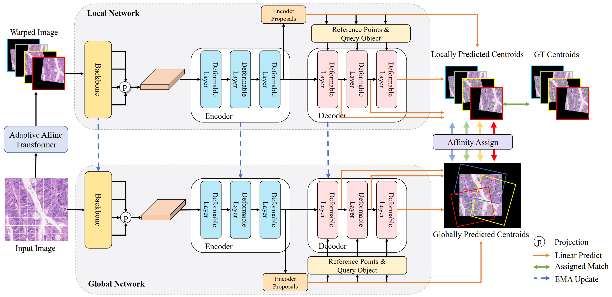

# ACFormer
Code for Affine-Consistent Transformer for Multi-Class Cell Nuclei Detection (ICCV 2023)

(Continually updating ...)

## Overall Framework

## Requisities
-`python=3.8`

-`pytorch=1.12.1+cu102`


## Installation
Install mmcv using mim
```
pip install -U openmim
mim install mmcv-full==1.6.1
```
Git clone acformer
```
git clone https://github.com/LL3RD/ACFormer.git
```
Install
```
cd ACFormer
cd thirdparty/mmdetection 
python -m pip install -e .
cd ../.. 
python -m pip install -e .
```
## Dataset
### Lizard Dataset
Your can download [Original Lizard](https://warwick.ac.uk/fac/cross_fac/tia/data/lizard) from the official website or [Preprocessed Lizard](https://drive.google.com/file/d/1Rsr0rlKOHi7mqKBrmV3yOvXcF6g6BCY1/view?usp=sharing) that is converted to hovernet consep format and split into patches.

### CoNSeP Dataset
Your can download [20x CoNSeP Dataset](https://drive.google.com/file/d/1uziLSN-59zV_Hxa226IlggMUwVQZP5bI/view?usp=sharing) from here.

### BRCA Dataset
Your can download [BRCA Dataset](https://github.com/TopoXLab/Dataset-BRCA-M2C) from the official website or [Preprocessed BRCA](https://drive.google.com/file/d/1HvIzsOs5FP9OdlJKAnU_PM6tX4B2Q1rk/view?usp=sharing).


## Main Result
### Lizard Dataset
| Method | F1d | F1c | Model Weights |Config Files|
| ---- | -----| ----- |----|----|
| ACFormer | 0.782 | 0.557 | [Checkpoint](https://drive.google.com/file/d/12FyfAQf5VU2poXvqE_FmrB2HL6VDCldj/view?usp=sharing)|[Config](https://drive.google.com/file/d/14scJog5GjZc-n-Uwn4sIAJcaO2tokxA-/view?usp=sharing)|

### CoNSeP Dataset
| Method | F1d | F1c | Model Weights  |Config Files|
| ---- | -----| ----- |----------------|----|
| ACFormer | 0.739 | 0.613 | [Checkpoint](https://drive.google.com/file/d/1HHaVTvqVjh80mlQsBCdTEgqhRiCSHEIj/view?usp=sharing) |[Config](https://drive.google.com/file/d/1KyVHbeiSE4GOSFOE08d-XdeAB3-sftRr/view?usp=sharing)|

### BRCA Dataset
| Method | F1d | F1c | Model Weights  |Config Files|
| ---- | -----| ----- |----------------|----|
| ACFormer | 0.796 | 0.485| [Checkpoint](https://drive.google.com/file/d/1W_Xkn14-wG6IPUeZ50O4zXsa-z-N9UH8/view?usp=sharing) |[Config](https://drive.google.com/file/d/1jyL5jOhVCfEXabnF4ornbRrRrzPS7LB1/view?usp=sharing)|


## Train
### For 20x CoNSeP Dataset
First Download the preprocess dataset and change the dataset path in config/ACFormer_CoNSeP.py and Run
```
CUDA_VISIBLE_DEVICES=0 bash tools/dist_train.sh configs/ACFormer_CoNSeP.py 1 --work-dir=Path to save
```

### For your own dataset (e.g. CoNSeP 40x for three classes)
#### Prepare Dataset
First Install the [sahi package](https://github.com/obss/sahi).
```
cd tools/sahi
pip install -e .
cd ..
```
Then Prepare the slicing dataset. (Modify the CoNSeP Path in prepare_consep_dataset_40x.py)
```
python prepare_consep_dataset_40x.py
```

Change the dataset path in config/ACFormer_CoNSeP_40x.py and Run
```
CUDA_VISIBLE_DEVICES=0 bash tools/dist_train.sh configs/ACFormer_CoNSeP_40x.py 1 --work-dir=Path to save
```


## Evaluation
Download the preprocessed dataset and Modify your dataset path and checkpoint path in tools/inference_lizard.py and run
```
python tools/inference_lizard.py
```

```
python tools/inference_consep.py
```

```
python tools/inference_brca.py
```
## Acknowledgement
- ACFormer is built based on [SoftTeacher](https://github.com/microsoft/SoftTeacher) and [MMDetection](https://github.com/open-mmlab/mmdetection).
